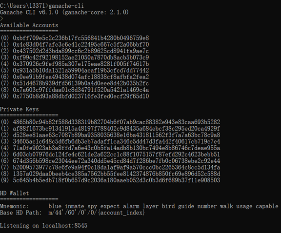
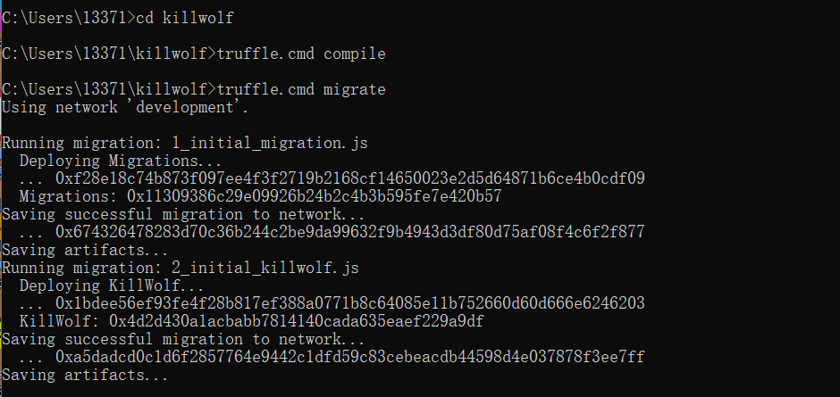
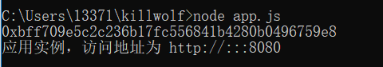
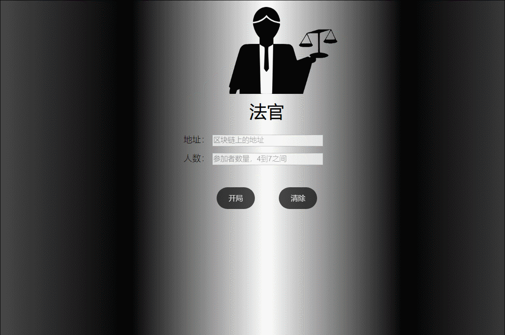
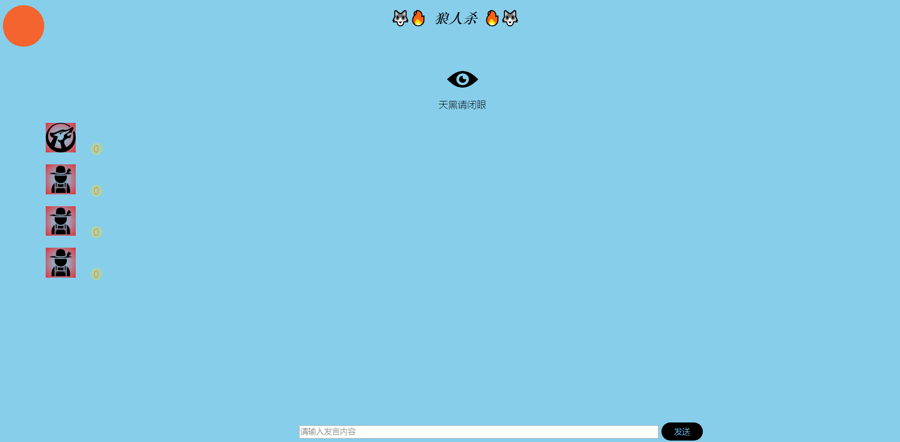
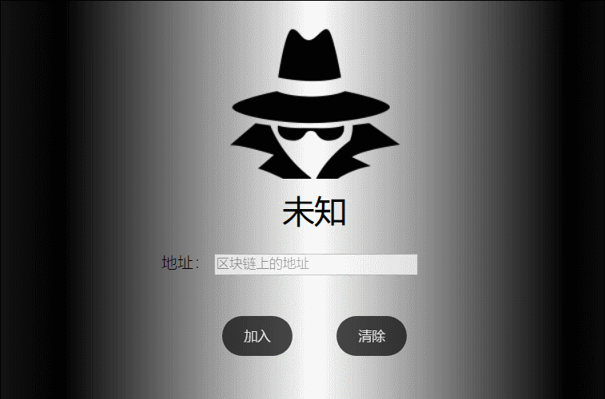
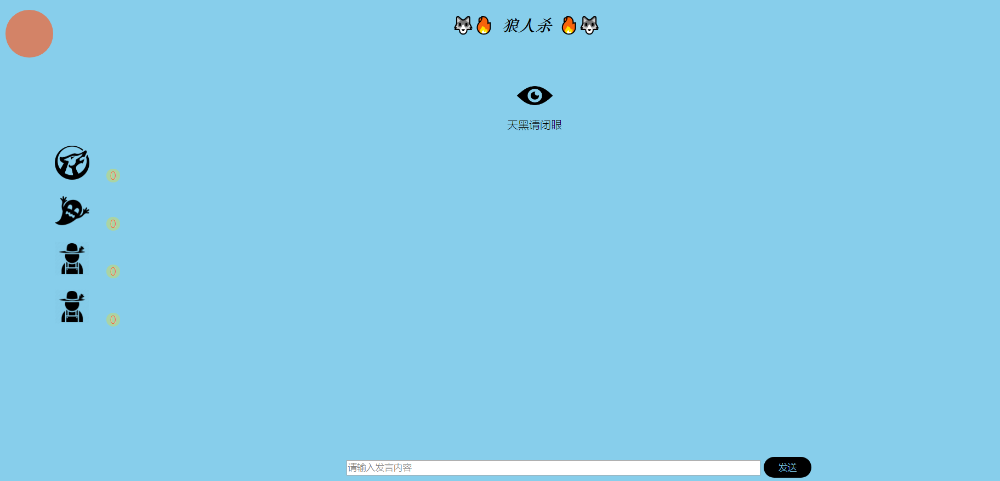
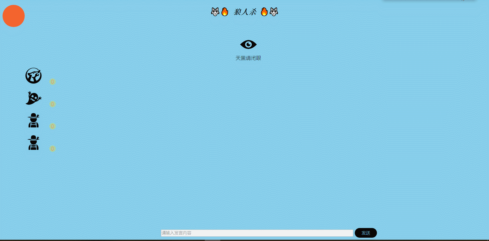
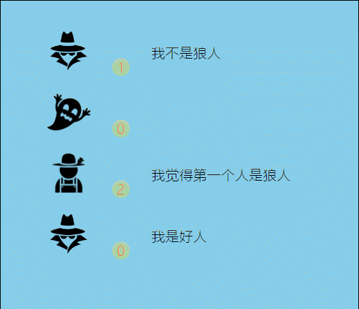

# 开启后台

- 运行仿真器

  

- 部署合约

  

- 调用app.js

# 完整流程

- 开启游戏（输入localhost:8080）

  

- 进入游戏界面

  

- 再次输入localhost:8080直接登录

  

- 全部登录后，法官可以点击“"天黑请闭眼"

  

- 狼人在夜间投票

  

- 投票完成，法官宣布天亮请睁眼

  

  

- 白天发言

  

- 白天投票

  

- 死去的人的头像处于不可点击状态

  
